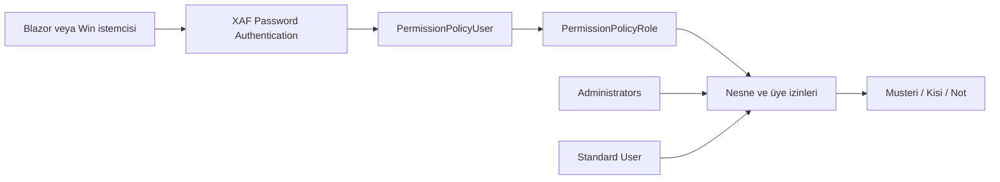

# Giriş ve Yetkilendirme Planı

## Amaç

Blazor ve Windows istemcilerinde aynı güvenlik altyapısını kullanarak iki başlangıç hesabı sağlamak:

| Rol | Hesap | Kapsam |
| --- | --- | --- |
| Yönetici | `Admin` | Kullanıcı/rol yönetimi dahil tüm işlemler |
| Standart kullanıcı | `User` | Müşteri, kişi ve not kayıtlarını görüntüleme ve yönetme |

> Mevcut durumda hesaplar `DatabaseUpdate/Updater.cs` içinde oluşturuluyor. Parolaları boş; `Default User` rolü de `AllowAllByDefault` kullanıyor. Bu plan bu geçici davranışı kaldırır.

## Hedef Mimari



- Kimlik doğrulama: Mevcut XAF `PasswordAuthentication` ve cookie altyapısı korunur.
- Yetkilendirme: Rol izinleri veritabanında `PermissionPolicyRole` üzerinden uygulanır.
- Veri erişimi: Her iki istemci `AddSecuredXpo` kullandığından aynı rol kuralları geçerli olur.
- Başlangıç verisi: Roller ve kullanıcılar idempotent biçimde `Updater` tarafından yalnızca yoksa eklenir.
- Gizli bilgiler: Başlangıç parolaları kaynak kodunda tutulmaz; geliştirmede User Secrets, dağıtımda ortam değişkeni ya da güvenli bir secret store kullanılır.

## Yetki Matrisi

| Kaynak | Admin | Standard User |
| --- | --- | --- |
| Müşteri | Oluştur, görüntüle, değiştir, sil | Oluştur, görüntüle, değiştir, sil |
| Kişi | Oluştur, görüntüle, değiştir, sil | Oluştur, görüntüle, değiştir, sil |
| Not | Oluştur, görüntüle, değiştir, sil | Oluştur, görüntüle, değiştir, sil |
| Kullanıcılar | Tam yönetim | Erişim yok |
| Roller ve izinler | Tam yönetim | Erişim yok |

İleride kayıt sahipliği istenirse, Standard User için kriter tabanlı erişim eklenir; bu ilk sürümde tüm iş kayıtlarını yönetebilir.

## Hedef Klasör Yapısı

```text
Project1/
├── Project1.Module/
│   ├── DatabaseUpdate/
│   │   └── Updater.cs                 # Roller ve başlangıç kullanıcıları
│   ├── Security/
│   │   ├── SecurityRoleNames.cs       # Rol/hesap sabitleri
│   │   └── RolePermissionFactory.cs   # Standart rolün açık izinleri
│   ├── Models/
│   │   └── Entities/
│   │       ├── Musteri.cs
│   │       ├── Kisi.cs
│   │       └── Not.cs
│   └── Controllers/
│       └── ...
├── Project1.Blazor.Server/
│   ├── Startup.cs                     # Authentication + secured XPO
│   └── appsettings.json               # Sadece parola anahtarları; değerler secret store'da
├── Project1.Win/
│   └── WinApplication.cs
└── docs/
    └── architecture/
        └── authentication-authorization-plan.md
```

## Uygulama Aşamaları

1. `SecurityRoleNames` ile `Administrators`, `Standard User`, `Admin` ve `User` adlarını tek yerde tanımla.
2. `Updater` içindeki `Default User` rolünü `Standard User` olarak taşı; `AllowAllByDefault` yerine sadece Müşteri, Kişi ve Not için açık CRUD izinleri oluştur.
3. Standard User rolüne `PermissionPolicyUser` ve `PermissionPolicyRole` erişimini kapat.
4. Admin rolünü yönetsel (`IsAdministrative = true`) bırak; Admin hesabını buna bağla.
5. Admin ve User ilk parolalarını yapılandırmadan güvenli şekilde oku. Parola boşsa üretim ortamında uygulama başlamadan hata ver.
6. İlk başarılı girişten sonra parola değiştirmeyi zorunlu kılacak akışı ekle veya dağıtım sırasında parolayı yönetici belirlesin.
7. Blazor ve Win için iki hesapla kabul testleri yap.

## Kabul Kriterleri

- `Admin` giriş yapabilir ve kullanıcı/rol yönetim ekranlarına erişir.
- `User` giriş yapabilir; müşteri, kişi ve not ekleyip düzenleyebilir.
- `User`, kullanıcı ve rol kayıtlarını göremez/değiştiremez.
- Boş parola ile hiçbir başlangıç hesabı oluşturulmaz.
- Aynı kurallar Blazor ve Win istemcilerinde geçerlidir.
