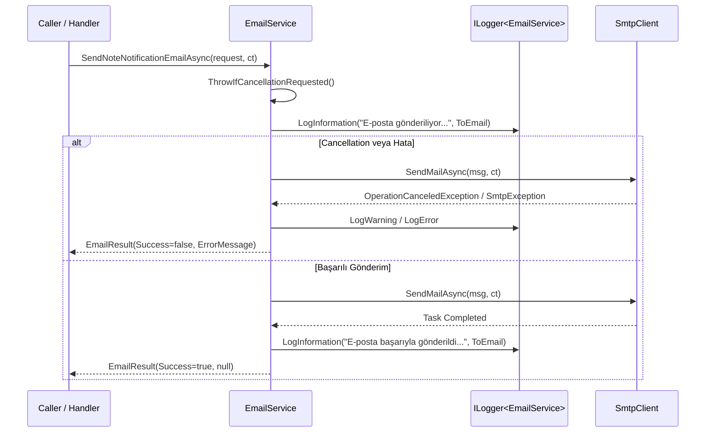

# Kritik Düzeltmeler Tasarım Dokümanı (EmailService, NoteService, Controller Ayrımı)

## 1. Genel Bakış ve Amaç
Bu doküman, `Project1` mimarisindeki 4 kritik teknik borç ve hatanın giderilmesine ilişkin mimari tasarımı tanımlar:
1. **`EmailService` — CancellationToken & Asenkron İptal:** `IEmailService.SendNoteNotificationEmailAsync` metodunda `CancellationToken`'ın operasyon seviyesinde kullanılması ve `OperationCanceledException` yönetimi.
2. **`EmailService` — `ILogger<EmailService>` ve Structured Logging:** Eski/eksik `DevExpress.Persistent.Base.Tracing` çağrılarının kaldırılarak ASP.NET Core `ILogger<EmailService>` altyapısına geçilmesi, log seviyeleri (Information, Warning, Error) ve hassas veri gizliliği standardizasyonu.
3. **`NoteService.CreateNoteAsync` — Müşteri ve Kişi Nesne Grafiği Bağlantısı:** `CreateNoteRequestDto` üzerinden gelen `MusteriOid` ve `KisiOid` kimliklerinin `IObjectSpace` üzerinden sorgulanarak `Not` nesnesinin `Musteri` ve `Kisi` navigasyon özelliklerine bağlanması.
4. **`SystemStatusControllers.cs` — Dosya ve Sorumluluk Ayrımı:** Tek bir dosyada toplanmış olan `SystemStatusApiController` (ASP.NET Core REST API) ile `SystemStatusWindowController` (DevExpress XAF WindowController) sınıflarının bağımsız dosyalara ayrılması ve ilgili testlerin güncellenmesi.

---

## 2. Mimari ve Bileşen Tasarımı

### 2.1. `EmailService` İyileştirmeleri

#### CancellationToken & Cooperative Cancellation
- `cancellationToken.ThrowIfCancellationRequested()` kontrolü işlem başlangıcında ve kritik noktalarda çalıştırılır.
- `.NET 8` standardındaki `SmtpClient.SendMailAsync(MailMessage, CancellationToken)` çağrısı kullanılır.
- Olası `OperationCanceledException` yakalandığında:
  - `_logger.LogWarning("E-posta gönderim işlemi iptal edildi. Alıcı: {ToEmail}", request.ToEmail);`
  - `new EmailResult(false, "E-posta gönderim işlemi iptal edildi.")` döndürülür.

#### `ILogger<EmailService>` Entegrasyonu
- `Microsoft.Extensions.Logging.ILogger<EmailService>` DI ile `EmailService` sınıfına enjekte edilir.
- Bağımsız testlerde veya DI dışı çağrılarda `NullLogger<EmailService>.Instance` varsayılan olarak kullanılır.
- Loglama formatı:
  - **Başlangıç:** `_logger.LogInformation("E-posta bildirimi gönderiliyor. Alıcı: {ToEmail}, Başlık: {Title}", request.ToEmail, request.Title);`
  - **Başarı:** `_logger.LogInformation("E-posta başarıyla gönderildi. Alıcı: {ToEmail}", request.ToEmail);`
  - **Hata:** `_logger.LogError(ex, "E-posta gönderimi başarısız oldu. Alıcı: {ToEmail}", request.ToEmail);`
- Şifreler veya gizli anahtarlar asla loglanmaz.



---

### 2.2. `NoteService` & `CreateNoteRequestDto` İlişki Yönetimi

#### DTO Tanımı (`Project1.DTOs/Notes/NoteDto.cs`):
```csharp
public record CreateNoteRequestDto(
    string Baslik,
    string Icerik,
    int Derece,
    Guid? MusteriOid = null,
    Guid? KisiOid = null
);
```

#### Nesne Grafiği ve Kayıt Mantığı (`Project1.Module/Services/Implementations/NoteService.cs`):
```csharp
public Task<NoteDto> CreateNoteAsync(CreateNoteRequestDto request, CancellationToken cancellationToken = default)
{
    cancellationToken.ThrowIfCancellationRequested();
    
    using IObjectSpace objectSpace = CreateObjectSpace();
    var not = objectSpace.CreateObject<Not>();
    not.Baslik = request.Baslik;
    not.Icerik = request.Icerik;
    not.Derece = (BusinessObjects.Enums.NotDerecesi)request.Derece;

    if (request.MusteriOid.HasValue && request.MusteriOid.Value != Guid.Empty)
    {
        not.Musteri = objectSpace.GetObjectByKey<Musteri>(request.MusteriOid.Value);
    }

    if (request.KisiOid.HasValue && request.KisiOid.Value != Guid.Empty)
    {
        not.Kisi = objectSpace.GetObjectByKey<Kisi>(request.KisiOid.Value);
    }

    objectSpace.CommitChanges();

    return Task.FromResult(MapToDto(not));
}
```

---

### 2.3. Controller Ayrımı

#### Yeni Dosya Yapısı:
1. `Project1/Project1.Blazor.Server/Controllers/SystemStatusApiController.cs`:
   - Yalnızca `SystemStatusApiController` sınıfını (`[ApiController]`, `[Route("api/systemstatus")]`) içerir.
2. `Project1/Project1.Blazor.Server/Controllers/SystemStatusWindowController.cs`:
   - Yalnızca `SystemStatusWindowController` sınıfını (`WindowController`) içerir.
3. `Project1/Project1.Blazor.Server/Controllers/SystemStatusControllers.cs`:
   - **Silinecek.**

---

## 3. Test ve Doğrulama Planı

### 3.1. Otomatik Testler (`Project1.Module.Tests`)
* **`EmailServiceTests`:**
  - `SendNoteNotificationEmailAsync_ShouldHandleCancellation_WhenTokenIsCancelled`: İptal edilmiş token ile çağrıldığında operasyonun iptal sonucunu doğrulama.
  - `SendNoteNotificationEmailAsync_ShouldUseLogger_WhenLoggerIsProvided`: Logların tetiklendiğini mock logger üzerinden doğrulama.
  - `SendNoteNotificationEmailAsync_ShouldReturnFailure_WhenConfigurationIsInvalid`: Var olan doğrulama testleri.
* **`NoteServiceTests`:**
  - `CreateNoteAsync_ShouldLinkMusteriAndKisi_WhenValidIdsProvided`: Musteri ve Kisi ID'leri verildiğinde nesne ilişkisinin ve DTO eşlemesinin doğrulanması.
* **`ApiEndpointAttributeTests`:**
  - `SystemStatusApiController_ShouldHaveAllowAnonymousAndEnableCorsAttributes`: `SystemStatusApiController.cs` dosyasını arayıp öznitelikleri doğrulama.

### 3.2. Manuel & Entegrasyon Doğrulaması
* `dotnet build InternshipProject.sln` ile sıfır hata/uyarı derleme.
* `dotnet test InternshipProject.sln` ile tüm testlerin yeşil geçmesi.
