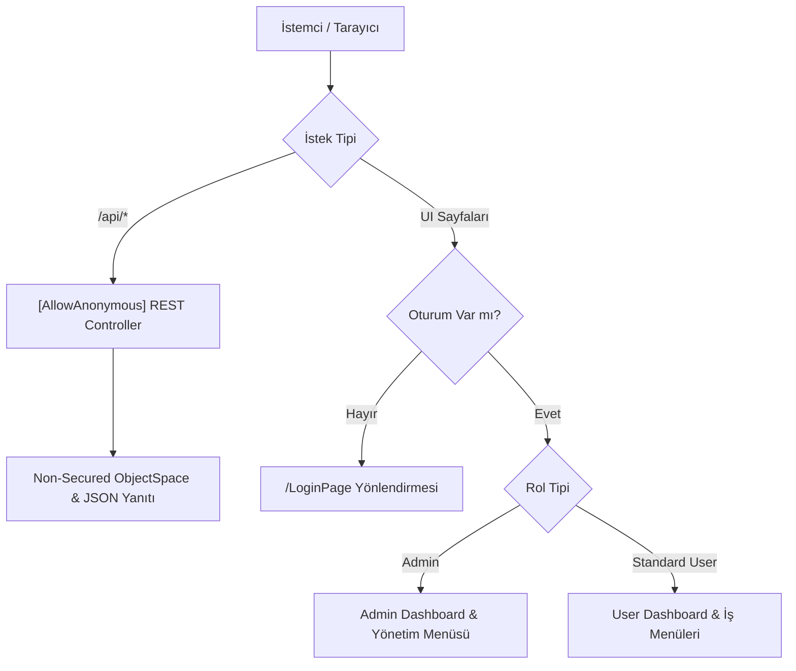

# User ve Admin Area Ayrımı & Login Öncesi Endpoint/URL Düzenleme Tasarım Dokümanı

## 1. Genel Bakış ve Amaç
Bu tasarımın amacı, **Project1 DevExpress XAF Blazor** uygulamasında:
1. **Login Öncesi Güvenlik & Anonim Endpoint Yönetimi:**
   - Oturum açmamış kullanıcıların doğrudan `/LoginPage` rotasına yönlendirilmesini sağlamak.
   - REST API endpoint'lerinin (`/api/notes`, `/api/systemstatus`) dış istemciler (özellikle **Project2**) tarafından kimlik doğrulaması gerekmeksizin (`[AllowAnonymous]`) tüketilebilmesini sağlamak.
2. **Rol Tabanlı Area ve Dashboard Ayrımı:**
   - Yönetici (`Admin`) ve Standart Kullanıcı (`User`) için XAF Model ve Navigasyon katmanında iki ayrı çalışma alanı oluşturmak.
   - Giriş sonrasında `Admin` kullanıcısını `AdminDashboard_View` (Yönetici Paneli) ve Yönetim menülerine; `User` kullanıcısını `UserDashboard_View` (Kullanıcı Paneli) ve operasyonel iş menülerine dinamik olarak yönlendirmek.

---

## 2. Mimari ve Bileşen Tasarımı

### 2.1. Login Öncesi Yönlendirme ve REST API Katmanı
* **Kimlik Doğrulama:**
  - ASP.NET Core Cookie Authentication ile `LoginPath = "/LoginPage"` olarak korunur.
  - Korumalı UI yollarına yapılan anonim istekler `/LoginPage`'e yönlendirilir.
* **Anonim REST API'ler:**
  - `NotesApiController` (`Project1.Blazor.Server/Controllers/NotesApiController.cs`):
    - `[ApiController]`, `[Route("api/notes")]`, `[AllowAnonymous]`, `[EnableCors("AllowAll")]`
    - `INoteService` üzerinden `INonSecuredObjectSpaceFactory` kullanılarak güvenli ve anonim veri transferi sağlar.
  - `SystemStatusApiController` (`Project1.Blazor.Server/Controllers/SystemStatusControllers.cs`):
    - `[ApiController]`, `[Route("api/systemstatus")]`, `[AllowAnonymous]`, `[EnableCors("AllowAll")]`
    - Canlı sistem durumunu döner.

---

### 2.2. XAF Model & Navigasyon Ağacı (`Model.xafml`)
* **Dashboard Görünümleri:**
  1. `AdminDashboard_View`:
     - Başlık: "Yönetici Paneli"
     - İlgili Bileşen: `Project1.Blazor.Server.Pages.AdminDashboard`
  2. `UserDashboard_View`:
     - Başlık: "Kullanıcı Paneli"
     - İlgili Bileşen: `Project1.Blazor.Server.Pages.Dashboard`
* **Navigasyon Yapısı:**
  - **`Default` Grubu:**
    - `AdminDashboard_View` (Index: 0, Image: "Action_Grant")
    - `UserDashboard_View` (Index: 1, Image: "Action_Home")
    - `Musteri_ListView` (Index: 2)
    - `Kisi_ListView` (Index: 3)
    - `Not_ListView` (Index: 4)
  - **`Yonetim` Grubu:**
    - `UserEmailPermission_ListView` (Index: 0, Caption: "E-posta Yetkileri")

---

### 2.3. Dinamik Yönlendirme ve Menü Güvenliği Denetleyicileri
1. **`DashboardRoutingController` (`Project1.Module/Controllers/Navigation/DashboardRoutingController.cs`):**
   - XAF `ShowNavigationItemController` üzerinden `ItemsInitialized` olayında tetiklenir.
   - Kullanıcı `Admin` ise varsayılan/aktif navigasyon öğesini `AdminDashboard_View` yapar.
   - Kullanıcı `Standard User` ise varsayılan/aktif navigasyon öğesini `UserDashboard_View` yapar.
2. **`MenuSecurityController` (`Project1.Module/Controllers/Navigation/MenuSecurityController.cs`):**
   - Kullanıcı `Standard User` olduğunda:
     - `AdminDashboard_View` öğesini menüden kaldırır.
     - `Yonetim` grubunu ve altındaki `UserEmailPermission_ListView` öğesini kaldırır.
     - Güvenlik modelleri olan `Role` ve `User` öğelerini kaldırır.
   - Kullanıcı `Admin` olduğunda:
     - `UserDashboard_View` öğesini menüden kaldırır (isteğe bağlı olarak her iki görünüm de bırakılabilir).
     - Yönetim menülerine tam erişim sağlar.

---

### 2.4. Güvenlik İzinleri ve Veritabanı Güncelleme
* **`AdminRoleConfigurator` (`Project1.Module/Security/SecurityConfig.cs`):**
  - `AdminDashboard_View` navigasyon izni: `Allow`
  - `Yonetim` ve `UserEmailPermission_ListView` navigasyon izinleri: `Allow`
* **`StandardUserRoleConfigurator` (`Project1.Module/Security/SecurityConfig.cs`):**
  - `UserDashboard_View` navigasyon izni: `Allow`
  - `AdminDashboard_View` ve `Yonetim` öğeleri için navigasyon izni verilmez (`DenyAllByDefault`).
* **`Updater.cs` (`Project1.Module/DatabaseUpdate/Updater.cs`):**
  - Rol yetkilerini sıfırlayıp güncel yapı ile yeniden oluşturur.

---

## 3. Doğrulama ve Test Planı

### 3.1. Otomatik Testler (`Project1.Module.Tests`)
* **`AuthorizationTests.cs`:**
  - Admin rolünün `AdminDashboard_View` ve `UserEmailPermission_ListView` izinlerine sahip olduğunu doğrular.
  - Standard User rolünün `UserDashboard_View` iznine sahip olduğunu, `AdminDashboard_View` ve `Yonetim` öğelerine erişemediğini doğrular.
* **`ApiEndpointTests.cs`:**
  - `NotesApiController` ve `SystemStatusApiController` sınıflarının `[AllowAnonymous]` ve `[EnableCors("AllowAll")]` özniteliklerine sahip olduğunu doğrular.

### 3.2. Manuel Doğrulama
* Anonim kullanıcı olarak `http://localhost:5000/` çağrılır -> `/LoginPage` sayfasına yönlendiği doğrulanır.
* `http://localhost:5000/api/systemstatus` ve `http://localhost:5000/api/notes` anonim olarak çağrılır -> `200 OK` JSON alındığı doğrulanır.
* `Admin` girişi yapılır -> Yönetici Paneli açılır ve Yönetim menüsü görünür.
* `User` girişi yapılır -> Kullanıcı Paneli açılır; Yönetim menüsü ve Yönetici paneli gizlenir.
