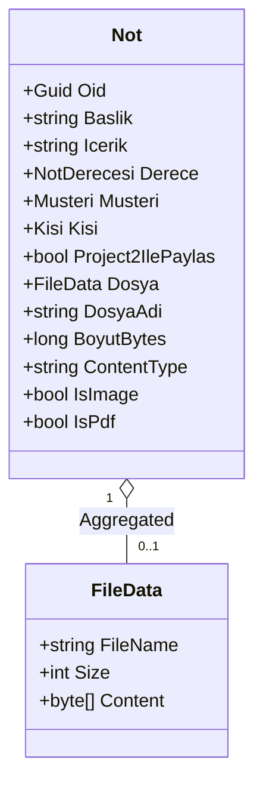

# Not Formunda Doğrudan Dosya Eki (PDF / Görsel) ve Project2 Paylaşımı Tasarım Dokümanı

## 1. Genel Bakış ve Amaç
Bu tasarımın amacı:
1. **Project1 (DevExpress XAF CRM):**
   - Not oluşturma ve düzenleme ekranındaki karmaşık alt tablo (`XPCollection<NotEk> Ekler`) yapısını kaldırıp, doğrudan form alanları arasına tek tıkla işletim sisteminin dosya seçici penceresini açan `FileData Dosya` özelliğini entegre etmek.
   - Sadece PDF ve Görsel dosyaların (`*.pdf;*.png;*.jpg;*.jpeg;*.gif;*.webp;*.bmp`) seçilebilmesini sağlamak (`FileTypeFilter`).
   - Not kaydedildiğinde dosyanın XPO `FileData` ile veritabanında güvenli şekilde saklanması.
2. **Project2 Paylaşım ve REST API:**
   - `Project2IlePaylas` (`bool`) alanı işaretli olan notların dosya ekleri ile birlikte REST API (`/api/notes` ve `/api/attachments/{noteId}/download`) üzerinden Project2'ye sunulması.
3. **Project2 (Blazor Server Web UI):**
   - Paylaşılan notlar listesinde (`/notes`) her nota ait dosya ekinin tekil olarak gösterilmesi.
   - PDF dosyaları için tek tıkla yeni sekmede açma / indirme butonu, görseller için tıklandığında büyütülen görsel önizleme modalı (`Image Preview Modal`).

---

## 2. Mimari ve Bileşen Tasarımı

### 2.1. Domain Katmanı (`Project1.Module`)

#### `Not.cs` Güncellemesi
* **`Dosya` Alanı:**
  - Tür: `FileData`
  - Nitelikler: `[Aggregated]`, `[FileTypeFilter("PDF ve Görseller", "*.pdf;*.png;*.jpg;*.jpeg;*.gif;*.webp;*.bmp")]`, `[XafDisplayName("Dosya Eki (PDF / Görsel)")]`
* **Yardımcı Özellikler:**
  - `string DosyaAdi => Dosya?.FileName ?? string.Empty;`
  - `long BoyutBytes => Dosya?.Size ?? 0;`
  - `string ContentType => GetContentType(Dosya?.FileName);`
  - `bool IsImage => ContentType.StartsWith("image/", StringComparison.OrdinalIgnoreCase);`
  - `bool IsPdf => ContentType.Equals("application/pdf", StringComparison.OrdinalIgnoreCase);`
* **Kaldırılan Yapı:**
  - `NotEk.cs` sınıfı ve `Not` içerisindeki `XPCollection<NotEk> Ekler` alt koleksiyonu tamamen kaldırılarak arayüzdeki alt grid temizlenir.



---

### 2.2. DTO & REST API Servis Katmanı (`Project1.DTOs` & `Project1.Blazor.Server`)

#### `NoteDto` Yapısı (`Project1.DTOs/Notes/NoteDto.cs` & `Project2/DTOs/NoteDto.cs`)
```csharp
public record NoteDto(
    Guid Oid,
    string Baslik,
    string Icerik,
    string Derece,
    string Musteri,
    string Kisi,
    bool IsEmailSent,
    bool Project2IlePaylas = false,
    DateTime CreatedDate = default,
    string? DosyaAdi = null,
    long BoyutBytes = 0,
    string? ContentType = null,
    string? DownloadUrl = null,
    bool IsImage = false,
    bool IsPdf = false,
    string MailDurumu = "Gonderilmedi",
    DateTime? MailGonderilmeTarihi = null,
    DateTime? MailIletilmeTarihi = null,
    DateTime? MailOkunmaTarihi = null
);
```

#### `INoteService` & `NoteService`
* `Task<IEnumerable<NoteDto>> GetNotesAsync(bool? onlyShared = null, CancellationToken cancellationToken = default);`
  - `onlyShared == true` olduğunda `Project2IlePaylas == true` olan notlar getirilir.
  - Nota bağlı `Dosya` varsa, `DownloadUrl = $"/api/attachments/{n.Oid}/download"` olarak atanır.
* `Task<(byte[] Bytes, string FileName, string ContentType)?> GetAttachmentFileAsync(Guid noteId, CancellationToken cancellationToken = default);`
  - `noteId` ile ilgili `Not` nesnesini bulur, `Dosya` baytlarını, dosya adını ve MIME türünü döner.

#### REST API Denetleyicileri
* **`NotesApiController` (`/api/notes`):**
  - `GET /api/notes?onlyShared=true`: Project2 için not listesini döner.
* **`AttachmentsApiController` (`/api/attachments`):**
  - `GET /api/attachments/{noteId}/download`: Belirtilen nota ait dosyayı stream eder (`[AllowAnonymous]`, `[EnableCors("AllowAll")]`).

---

### 2.3. Project2 Blazor Web Arayüzü (`Project2`)

* **`Pages/Notes.razor`:**
  - Tablo sütunu: "Ek (PDF / Görsel)"
  - Eğer `!string.IsNullOrEmpty(note.DownloadUrl)`:
    - `note.IsImage` ise: 🖼️ Önizleme butonu (`OpenImageModal`)
    - `note.IsPdf` ise: 📄 PDF Aç / İndir butonu (yeni sekmede açılır)
    - Diğer ise: 📎 Dosya İndir butonu
  - Eğer ek yoksa: `Ek yok` metni.
* **Resim Modal:** Mevcut görsel büyütme ve orijinal indirme modalı korunur.

---

## 3. Doğrulama ve Test Planı

### 3.1. Otomatik Birim Testleri (`Project1.Module.Tests`)
1. **`NotDomainTests`:**
   - `Not` oluşturulduğunda `Dosya` (`FileData`) atamasının çalıştığı, `DosyaAdi`, `BoyutBytes`, `IsImage`, `IsPdf` özelliklerinin doğru hesaplandığı test edilir.
2. **`NoteServiceTests`:**
   - `GetNotesAsync` metodunun dosya ekine sahip notlar için doğru `DownloadUrl` ve dosya meta verilerini DTO'ya aktardığı test edilir.
   - `GetAttachmentFileAsync` metodunun notun dosya baytlarını başarıyla getirdiği test edilir.
3. **`AttachmentsApiControllerTests`:**
   - Dosyası olan not için 200 OK ve dosya içeriği döndüğü; dosyası olmayan veya bulunamayan not için 404 Not Found döndüğü test edilir.

### 3.2. Manuel Doğrulama
1. Project1 XAF Blazor UI açılır:
   - Yeni Not oluşturulur, doğrudan formdaki "Gözat / Dosya Seç" butonuna tıklanarak bilgisayardan PDF/görsel seçilir.
   - Formun altında hiçbir alt tablo olmadığı gözlemlenir.
   - `Project2 ile Paylaş` işaretlenip kaydedilir.
2. Project2 Blazor Web açılır (`/notes`):
   - Paylaşılan notun ekli olarak listelendiği görülür.
   - PDF butonuna tıklandığında PDF'in açıldığı; resim butonuna tıklandığında modal içinde resmin büyütüldüğü doğrulanır.
