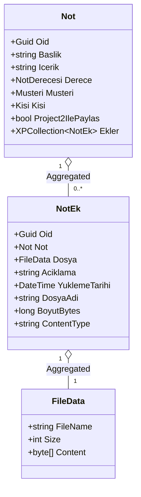

# Notlara PDF/Görsel Yükleme ve Project2 ile Paylaşım Tasarım Dokümanı

## 1. Genel Bakış ve Amaç
Bu tasarımın amacı:
1. **Not Dosya Ekleri (PDF & Görseller):**
   - Project1 (DevExpress XAF Blazor & WinForms) üzerinde notlara çoklu dosya eki (PDF, PNG, JPG, JPEG vb.) eklenmesini sağlamak.
   - DevExpress XPO `FileData` yerleşik dosya yönetimi kullanılarak dosya yükleme, indirme, dosya tipi kontrolü ve veri tabanı saklamasını gerçekleştirmek.
2. **Project2 Paylaşım Mekanizması:**
   - Not üzerinde `Project2IlePaylas` (`IsSharedWithProject2`) bayrağı ile notların Project2 ile paylaşılıp paylaşılmayacağını denetlemek.
   - REST API üzerinden (`/api/notes`) sadece paylaşılan notları ve bu notlara bağlı eklerin üst verilerini dış istemcilere sunmak.
3. **Project2 (Blazor Server) Entegrasyonu:**
   - Paylaşılan notları listeleyen modern arayüzde dosya eklerinin (PDF indirme/görüntüleme, Görsel önizleme/modal) sunulması.
   - `/api/attachments/{id}/download` endpoint'i üzerinden binary dosya akışının güvenli ve CORS uyumlu olarak sağlanması.

---

## 2. Mimari ve Bileşen Tasarımı

### 2.1. Domain & Veri Katmanı (`Project1.Module`)

#### `Not.cs` Güncellemesi
* **`Project2IlePaylas` Alanı:**
  - Tür: `bool`
  - Görüntüleme: `[XafDisplayName("Project2 ile Paylaş")]`
  - Görünürlük: `ListView` ve `DetailView` üzerinde aktif.
* **`Ekler` İlişkisi:**
  - `[Association("Not-Ekler"), Aggregated]`
  - Tür: `XPCollection<NotEk>`
  - Not silindiğinde ilişkili tüm ekler de otomatik silinir (`Cascade/Aggregated`).

#### `NotEk.cs` (Yeni XPO Varlığı)
* **Konum:** `Project1.Module/Models/Notes/NotEk.cs`
* **Alanlar:**
  - `Not Not`: `[Association("Not-Ekler")]`
  - `FileData Dosya`: `[Aggregated]`, `[FileTypeFilter("PDF ve Görseller", "*.pdf;*.png;*.jpg;*.jpeg;*.gif;*.webp;*.bmp")]`
  - `string Aciklama`: Opsiyonel dosya açıklaması
  - `DateTime YuklemeTarihi`: Oluşturma zamanı (varsayılan `DateTime.Now`)
  - `string DosyaAdi`: `Dosya?.FileName`
  - `long BoyutBytes`: `Dosya?.Size`
  - `string ContentType`: Dosya uzantısına göre MIME tipi (`application/pdf`, `image/png`, `image/jpeg` vb.)



---

### 2.2. DTO & REST API Servis Katmanı (`Project1.DTOs` & `Project1.Blazor.Server`)

#### DTO Tanımları (`Project1.DTOs/Notes/`)
* **`NoteAttachmentDto`:**
  ```csharp
  public record NoteAttachmentDto(
      Guid Oid,
      string DosyaAdi,
      string ContentType,
      long BoyutBytes,
      DateTime YuklemeTarihi,
      string DownloadUrl,
      bool IsImage,
      bool IsPdf
  );
  ```
* **`NoteDto`:**
  ```csharp
  public record NoteDto(
      Guid Oid,
      string Baslik,
      string Icerik,
      string Derece,
      string Musteri,
      string Kisi,
      bool IsEmailSent,
      bool IsSharedWithProject2 = false,
      List<NoteAttachmentDto>? Ekler = null,
      DateTime CreatedDate = default,
      string MailDurumu = "Gonderilmedi",
      DateTime? MailGonderilmeTarihi = null,
      DateTime? MailIletilmeTarihi = null,
      DateTime? MailOkunmaTarihi = null
  );
  ```

#### Servis Katmanı (`INoteService` & `NoteService`)
* `Task<IEnumerable<NoteDto>> GetNotesAsync(bool? onlyShared = null, CancellationToken cancellationToken = default);`
  - `onlyShared: true` olduğunda yalnızca `Project2IlePaylas == true` olan notlar listelenir.
  - `Ekler` listesi oluşturulurken her ek için `DownloadUrl` (`/api/attachments/{ek.Oid}/download`) atanır.
* `Task<(byte[] Bytes, string FileName, string ContentType)?> GetAttachmentFileAsync(Guid attachmentId, CancellationToken cancellationToken = default);`
  - İlgili `NotEk` nesnesini bularak dosya baytlarını, adını ve MIME tipini döner.

#### REST API Denetleyicileri
* **`NotesApiController` (`/api/notes`):**
  - `GET /api/notes?onlyShared=true`: Project2 için varsayılan olarak paylaşılan notları döner.
  - `GET /api/notes/{id}`: Not detayını ekleriyle birlikte döner.
* **`AttachmentsApiController` (`/api/attachments`):**
  - `GET /api/attachments/{id}/download`: Dosyayı `File(bytes, contentType, fileName)` olarak stream eder.
  - `[AllowAnonymous]`, `[EnableCors("AllowAll")]`.

---

### 2.3. Project2 Blazor Web Arayüzü (`Project2`)

#### DTO & ViewModel
* `Project2/DTOs/NoteDto.cs` ve `Project2/DTOs/NoteAttachmentDto.cs` Project1 ile senkronize edilir.
* `NoteListViewModel`: `/api/notes?onlyShared=true` adresinden verileri yükler.

#### `Pages/Notes.razor` Arayüz Geliştirmesi
* **Not Listesi:**
  - Tabloya "Ekler (PDF / Görsel)" sütunu eklenir.
* **Ekler Bileşeni:**
  - 📄 **PDF Dosyaları:** Tıklandığında yeni sekmede açılan / indirilen rozet butonlar.
  - 🖼️ **Görseller:** Thumbnail önizleme ve tıklandığında açılan görsel modal'ı (`Image Preview Modal`).
  - Dosya boyutu formatlaması (örn: `1.4 MB`, `240 KB`).

---

## 3. Doğrulama ve Test Planı

### 3.1. Otomatik Birim Testleri (`Project1.Module.Tests`)
1. **`NotDomainTests` & `NotEkDomainTests`:**
   - Not oluşturulup `Project2IlePaylas` özelliğinin doğru atandığı test edilir.
   - `Not` nesnesine `NotEk` eklendiğinde `Ekler` koleksiyonunda yer aldığı ve Not silindiğinde eklerin silindiği doğrulanır.
2. **`NoteServiceTests`:**
   - `GetNotesAsync(onlyShared: true)` çağrıldığında sadece paylaşılan notların döndüğü doğrulanır.
   - `Ekler` listesinin ve dosya URL'lerinin doğru map edildiği doğrulanır.
   - `GetAttachmentFileAsync` ile dosya içeriğinin eksiksiz çekildiği doğrulanır.
3. **`ApiEndpointAttributeTests`:**
   - `AttachmentsApiController`'ın `[AllowAnonymous]` ve `[EnableCors]` özniteliklerine sahip olduğu doğrulanır.

### 3.2. Manuel Doğrulama
1. Project1 XAF Blazor çalıştırılır:
   - Yeni bir not açılır, bir PDF ve bir resim dosyası eklenir.
   - `Project2 ile Paylaş` kutucuğu işaretlenir ve kaydedilir.
2. Project2 çalıştırılır:
   - `/notes` sayfası açılır.
   - Yalnızca paylaşılan notun geldiği görülür.
   - PDF butonuna tıklanıp dosyanın indiği/açıldığı doğrulanır.
   - Resim önizlemesine tıklanıp resmin modal içinde büyütüldüğü doğrulanır.
