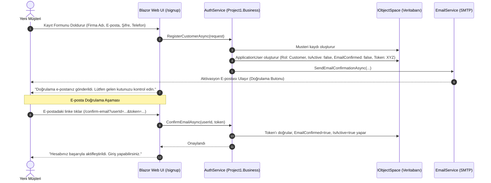

# Müşteri Portalı, Kayıt Ol (Sign-Up) ve E-Posta Doğrulama Tasarım Dokümanı

## 1. Amaç ve Vizyon
Bu tasarım, mevcut `InternshipProject` sistemine **Müşteri Portalı (Customer Portal)**, **Kendi Kendine Kayıt Olma (Public Sign-up)**, **E-posta Doğrulama (Email Confirmation)** ve **Müşteri Bazlı Satır Seviyesi Veri İzolasyonu (Row-Level Security)** yeteneklerini ekler.

---

## 2. Mimari ve Roller

```mermaid
flowchart TD
    subgraph Roles ["3 Seviyeli Rol Sistemi"]
        AdminRole["👑 Administrator (Admin)<br/>Sistem Yönetimi & Tüm Kayıtlar"]
        UserRole["👤 Standard User (User)<br/>Şirket İçi Personel (Tüm Müşteriler & Notlar)"]
        CustomerRole["🏢 Customer (Müşteri)<br/>Yalnızca Kendi Şirketi, Kişileri ve Notları"]
    end

    subgraph DataIsolation ["Veri İzolasyonu (XAF Security Criteria)"]
        CustomerRole -->|Filtre: [Oid] = CurrentUser.Musteri.Oid| MyMusteri["Müşteri Profilim"]
        CustomerRole -->|Filtre: [Musteri.Oid] = CurrentUser.Musteri.Oid| MyKisiler["İlgili Kişilerim (CRUD)"]
        CustomerRole -->|Filtre: [Musteri.Oid] = CurrentUser.Musteri.Oid| MyNotlar["Şirketime Ait Notlar"]
    end
```

### Rol İzinleri Matrisi:

| Kaynak / Ekran | Admin | Standard User | Customer (Müşteri) |
| :--- | :--- | :--- | :--- |
| **Müşteri (`Musteri`)** | Tam Yetki (Tüm firmalar) | Tam Yetki (Tüm firmalar) | Sadece Kendi Firması (`Read / Update`) |
| **Kişiler (`Kisi`)** | Tam Yetki (Tüm kişiler) | Tam Yetki (Tüm kişiler) | Sadece Kendi Kişileri (`Create / Read / Update / Delete`) |
| **Notlar (`Not`)** | Tam Yetki (Tüm notlar) | Tam Yetki (Tüm notlar) | Sadece Kendi Firmasının Notları (`Read`) |
| **Yönetim & Ayarlar** | Tam Yetki | Erişim Yok | Erişim Yok |

---

## 3. Kayıt Olma (Sign-Up) ve E-posta Aktivasyon Akışı



---

## 4. Katman Bazında Yapılacak Değişiklikler

### 4.1. `Project1.Core`
- **`IAuthService.cs`**:
  - `Task<RegisterResult> RegisterCustomerAsync(RegisterCustomerRequest request, CancellationToken ct = default);`
  - `Task<ConfirmEmailResult> ConfirmEmailAsync(Guid userId, string token, CancellationToken ct = default);`
- **`IEmailService.cs` Genişletmesi**:
  - `SendEmailConfirmationRequest(string ToEmail, string CustomerName, string ConfirmationUrl, DateTime ExpiryDate)`
  - `Task<EmailResult> SendConfirmationEmailAsync(SendEmailConfirmationRequest request, CancellationToken ct = default);`

### 4.2. `Project1.DTOs`
- **`RegisterCustomerRequest.cs`**:
  `public record RegisterCustomerRequest(string MusteriAdi, string Email, string Password, string Telefon, string? Adres);`
- **`RegisterResult.cs` & `ConfirmEmailResult.cs`**

### 4.3. `Project1.Module`
- **`ApplicationUser.cs`**:
  - `Musteri Musteri`: Kullanıcının bağlı olduğu müşteri firması.
  - `bool EmailConfirmed`: E-posta onay durumu.
  - `string? EmailConfirmationToken`: Benzersiz doğrulama anahtarı.
  - `DateTime? ConfirmationTokenExpiry`: Token son geçerlilik zamanı.
- **`SecurityConfig.cs` & `Updater.cs`**:
  - `CustomerRoleConfigurator`: Müşteri rolünün satır seviyesi kriterlerini (`[Musteri.Oid] = CurrentUser.Musteri.Oid`) tanımlar.

### 4.4. `Project1.Business`
- **`AuthService.cs`**:
  - Kayıt olma, şifre hash'leme, token üretme, `Musteri` ve `ApplicationUser` oluşturma, doğrulama linki oluşturup `EmailService` ile gönderme mantığı.
- **`EmailService.cs`**:
  - Şık, modern HTML aktivasyon e-posta şablonu.

### 4.5. `Project1.Blazor.Server`
- **`/signup` Sayfası**: Müşterinin web üzerinden kayıt olacağı modern form ekranı.
- **`/confirm-email` Sayfası**: Aktivasyon linkine tıklandığında doğrulama yapan ve kullanıcıyı login'e yönlendiren ekran.
- **XAF Logon Ekranı Özelleştirmesi**: Giriş ekranına *"Hesabınız yok mu? Müşteri olarak kayıt olun"* butonu.
- **Müşteri Kişi Oluşturma Denetleyicisi (`CustomerKisiController`)**: Müşteri yeni kişi eklerken `Musteri` alanını otomatik olarak kendi firması yapar.

---

## 5. Test ve Doğrulama Planı (`Project1.Module.Tests`)
1. **Müşteri Kayıt & Token Testi:** Kayıt sırasında `Musteri` ve `ApplicationUser` doğru ilişkiyle ve `EmailConfirmed=false` olarak oluşuyor mu?
2. **E-posta Doğrulama Testi:** Doğru token ile hesap aktifleşiyor mu, geçersiz/süresi dolmuş token reddediliyor mu?
3. **Müşteri İzolasyon Testi:** Giriş yapan Müşteri A kullanıcısı, Müşteri B'nin müşterisini, kişilerini ve notlarını göremiyor mu?
4. **Müşteri Kendi Kişisini Ekleme Testi:** Müşteri yeni kişi eklediğinde `Kisi.Musteri` otomatik kendi firması oluyor mu?
