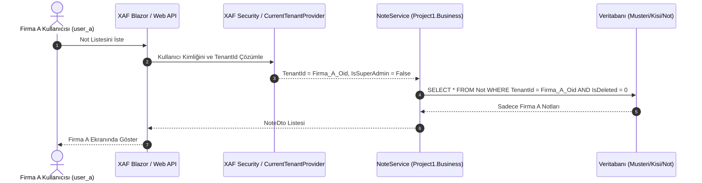

# Multi-Tenancy (Çoklu Kiracılık) Mimari Tasarım Dokümanı

## 1. Amaç ve Kapsam
Bu doküman, `InternshipProject` çözümünde paylaşımlı veritabanı (Single Database) üzerinde **Satır Seviyesi İzolasyon (Row-Level Data Isolation / Multi-Tenancy)** mimarisinin nasıl inşa edileceğini, katman bazında yapılacak geliştirmeleri ve güvenlik mekanizmasını tanımlar.

---

## 2. Mimari Yaklaşım: Shared DB with Row-Level Security
Tüm kiracılar (Tenant / Şirket) aynı fiziksel veritabanını ve tabloları kullanır. Veri güvenliği ve izolasyonu aşağıdaki 3 katmanlı zırh ile sağlanır:

1. **Varlık Seviyesi:** Tüm iş nesneleri (`Musteri`, `Kisi`, `Not`, `AuditLog`) `ITenantScoped` arayüzünü uygulayarak indekslenmiş bir `TenantId` (Guid) taşır.
2. **Kayıt Anı (OnSaving/AfterConstruction):** Yeni oluşturulan bir varlığın `TenantId` alanı, sisteme giriş yapmış aktif kullanıcının bağlı olduğu şirketin ID'si ile otomatik doldurulur.
3. **Sorgu ve Yetkilendirme Seviyesi (XAF Security + Business Service):**
   - Standart Kullanıcı ve Tenant Yöneticisi için tüm sorgular `[TenantId] = CurrentUser.Tenant.Oid` kriteri ile sınırlandırılır.
   - Super Admin rolü filtresiz erişimle tüm şirketleri yönetebilir.

---

## 3. Katman Bazında Yapılacak Geliştirmeler

### 3.1. `Project1.Core` (Sözleşmeler)
- **`ITenantScoped.cs`**:
  ```csharp
  namespace Project1.Core.MultiTenancy;

  public interface ITenantScoped
  {
      Guid? TenantId { get; set; }
  }
  ```
- **`ICurrentTenantProvider.cs`**:
  ```csharp
  namespace Project1.Core.MultiTenancy;

  public interface ICurrentTenantProvider
  {
      Guid? CurrentTenantId { get; }
      string? CurrentTenantCode { get; }
      bool IsSuperAdmin { get; }
  }
  ```

### 3.2. `Project1.DTOs` (Veri Transfer Modelleri)
- **`TenantDto.cs`**:
  ```csharp
  namespace Project1.DTOs.Tenants;

  public record TenantDto(
      Guid Oid,
      string Name,
      string Code,
      bool IsActive,
      DateTime CreatedAt
  );

  public record CreateTenantRequest(string Name, string Code);
  public record UpdateTenantRequest(string Name, bool IsActive);
  ```

### 3.3. `Project1.Module` (Domain & Security)
- **`Models/Tenants/Tenant.cs` (XPO Entity)**:
  - `Name` (Şirket Adı - string, zorunlu)
  - `Code` (Şirket Kodu - string, benzersiz/indexed, örn: `ACME`, `BOLTAS`)
  - `IsActive` (bool)
  - `CreatedAt` (DateTime)
- **`Models/Base/AuditedBaseObject.cs`**:
  - `ITenantScoped` arayüzünü uygular.
  - `TenantId` (Guid?, Indexed) alanı eklenir.
  - `OnSaving()` içinde eğer `TenantId` boş ise `SecuritySystem.CurrentUser` üzerinden `ApplicationUser.Tenant.Oid` otomatik atanır.
- **`Models/Security/ApplicationUser.cs`**:
  - `Tenant` (Tenant referansı, nullable: Super Admin için null, diğerleri için zorunlu).
  - `IsSuperAdmin` (bool, varsayılan false).
- **`DatabaseUpdate/Updater.cs` & `SecurityConfig.cs`**:
  - Örnek Kiracılar: `Tenant A (Firma A - ACME)` ve `Tenant B (Firma B - GLOBAL)`.
  - Roller:
    - `Super Administrators`: Şirketler, Kullanıcılar ve tüm veriler üzerinde sınırsız yetki.
    - `Tenant Administrators`: Kendi şirketi içindeki kullanıcıları ve iş verilerini tam yönetme (`[Tenant.Oid] = CurrentUser.Tenant.Oid`).
    - `Standard Users`: Sadece kendi şirketinin `Musteri`, `Kisi`, `Not` kayıtlarına CRUD yetkisi (`[TenantId] = CurrentUser.Tenant.Oid`).
  - Başlangıç Kullanıcıları:
    - `superadmin`: Super Administrators rolü, `Tenant = null`.
    - `admin_a` & `user_a`: Tenant A kullanıcıları.
    - `admin_b` & `user_b`: Tenant B kullanıcıları.

### 3.4. `Project1.Mapping` (Dönüşümler)
- **`TenantMapper.cs`**:
  - `IMapper<Tenant, TenantDto>` implementasyonu.

### 3.5. `Project1.Business` (İş Mantığı ve Servisler)
- **`CurrentTenantProvider.cs`**:
  - `ICurrentTenantProvider` implementasyonu. XAF `ISecurityStrategyBase` ve `IHttpContextAccessor` üzerinden oturumdaki `ApplicationUser` bilgilerini okur.
- **`NoteService.cs`**:
  - Not listeleme ve arama işlemlerinde `CurrentTenantProvider.IsSuperAdmin` kontrolü yapar; normal kullanıcılar için sorguya `TenantId` filtresi ekler.

### 3.6. `Project1.Blazor.Server` & `Project1.Win` (Host)
- `Startup.cs` içinde `ICurrentTenantProvider` DI kaydı:
  ```csharp
  services.AddScoped<ICurrentTenantProvider, CurrentTenantProvider>();
  services.AddSingleton<IMapper<Tenant, TenantDto>, TenantMapper>();
  ```

---

## 4. Akış Şeması (Veri İzolasyon Güvencesi)



---

## 5. Test ve Doğrulama Planı (`Project1.Module.Tests`)

1. **`TenantIsolationTests.cs`**:
   - `Firma A` kullanıcısının oluşturduğu bir Not kaydının, `Firma B` kullanıcısının sorgusunda **asla** listelenmediği doğrulanacak.
   - `Firma A` kullanıcısının, `Firma B`'ye ait bir kaydın OID'sini doğrudan bilse dahi güncelleyemeyeceği/okuyamayacağı doğrulanacak.
2. **`TenantAutoAssignmentTests.cs`**:
   - `Firma A` kullanıcısı `new Not(uow)` oluşturup kaydettiğinde `TenantId` alanının otomatik olarak `Firma A.Oid` değerini aldığı doğrulanacak.
3. **`SuperAdminAccessTests.cs`**:
   - `superadmin` kullanıcısının hem `Firma A` hem de `Firma B` kayıtlarını eksiksiz listeleyebildiği doğrulanacak.
4. **Regresyon Testleri:**
   - Mevcut tüm API, Mapping, DTO ve Domain testlerinin hatasız çalıştığı doğrulanacak.
